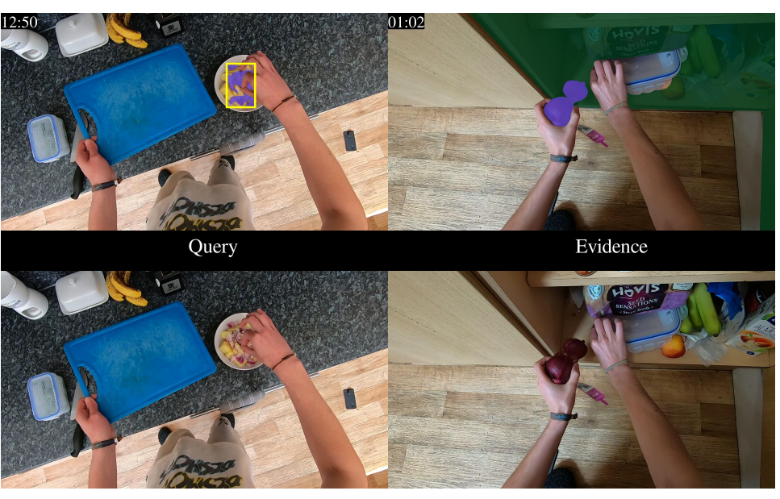
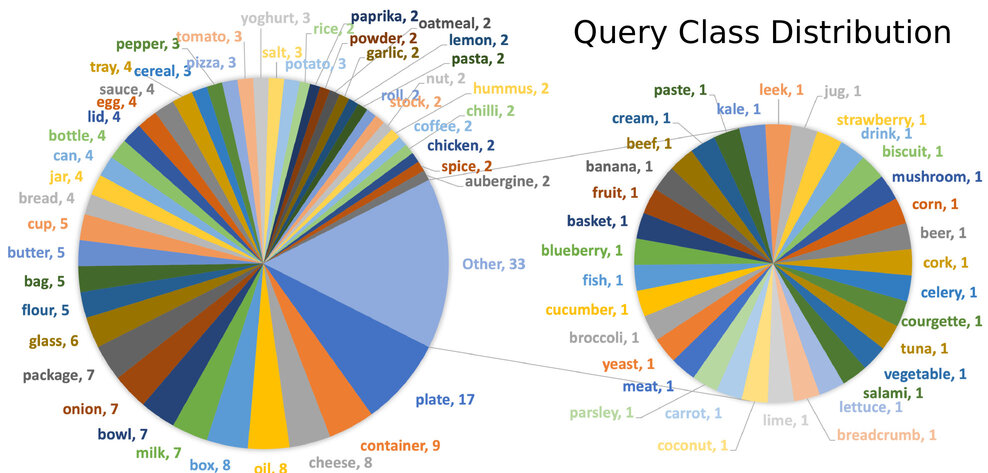
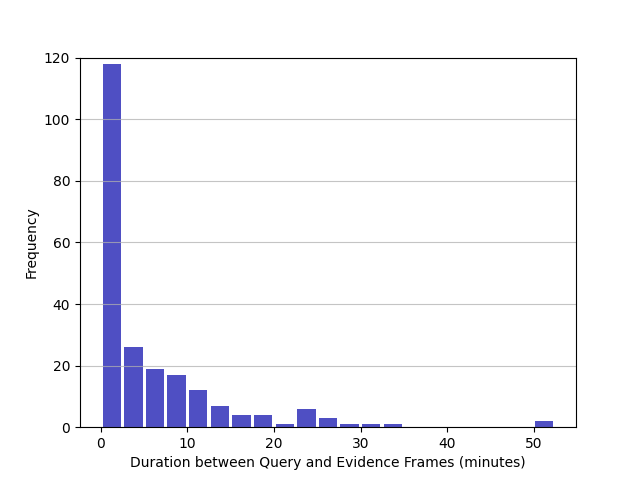

# VISOR WDTCF

## Overview
*Where Did This Come From (WDTCF)?* is a taster benchmark for long-term perception with scene segmentation. Given a frame from an untrimmed video with a mask indicating a query object, the task aims to trace the mask back through time to identify WDTCF, e.g., milk from the fridge, and a plate from a particular cupboard.


For example, where did this (**onion**) come from?

<div align="center">
  
</div>

Answer: **Cupboard**

## Statistics
In total, 224 WDTCF examples are obtained from 92 untrimmed videos in train and val sets of VISOR, with 78 unique query objects. The gap between the query and evidence frames is 5.4 mins (19K frames) on average, but it varies widely with a standard deviation of 8 mins (min=1s, max=52 mins). 

<!--  -->

<div align="center">

  
</div>

## Annotation Download
The annotations include the following:
* `Query frame ID`: frame to ask the question 'where did this come from?'.
* `Query object`: object of interest in the query frame and 'this' in the question. Note that we assume object name is unknown and only mask of the object is provided as input.
* `Source object`: a finite list of 15 sources from which objects emerge in the kitchen, i.e., [fridge, freezer, cupboard, drawer, oven, dishwasher, bag, bottle, box, package, jar, can, pan, tub, cup].
* `Evidence frame ID`: evidence to infer the answer for the question, i.e, the query object emerging from the source object.

[Download WDTCF_GT.json](https://www.dropbox.com/s/dc15fh9qkkffnhm/WDTCF_GT.json?dl=0)

## Annotation Visulization 


[Download all annotation visulization](https://www.dropbox.com/s/06yk26c2f4zszzg/WDTCF_Vis.zip?dl=0)


## Evaluation Code
```shell
python evaluation.py
```

Download the VISOR annotations [here](https://epic-kitchens.github.io/VISOR/).

Prepare your prediction, the folder structure should look like
```
Prediction
|   WDTCF_preds.json
|   P01_01_celery_query_pred.png
|   P01_01_celery_source_pred.png
|   ...
|   P37_101_chicken_query_pred.png
|   P37_101_chicken_source_pred.png
```

The keys in WDTCF_preds are the same with WDTCF_GT, e.g., P37_101_chicken, and the prediction for each query includes:
* `query_pred`: prediction of the query object class ID, e.g., 58.
* `answer_pred`: prediction of the source object class ID, e.g., 13.
* `evidence_frame_pred`: prediction of the evidence frame, e.g., P37_101_frame_0000000512.jpg.

`PX_X_X_query_pred.png` and `PX_X_X_source_pred.png` are the prediction of query and source masks respectively (resolution: 1080x1920).


